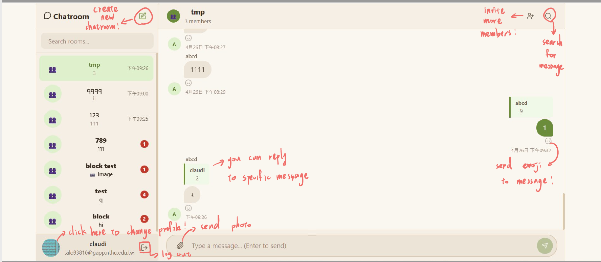
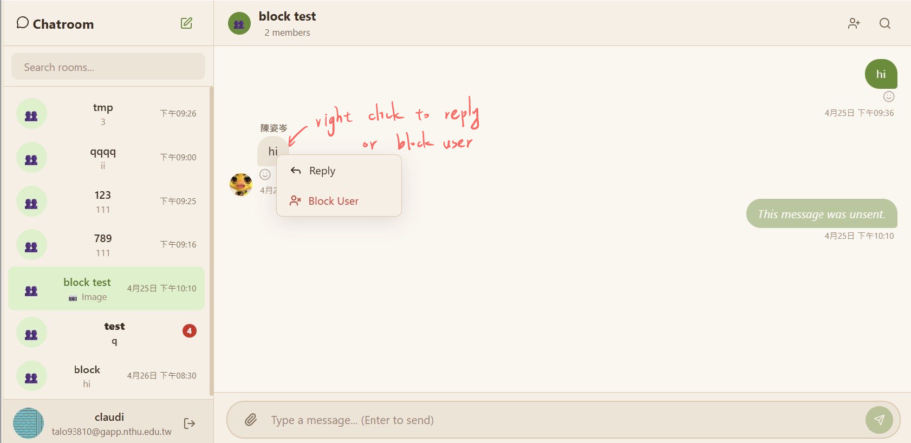
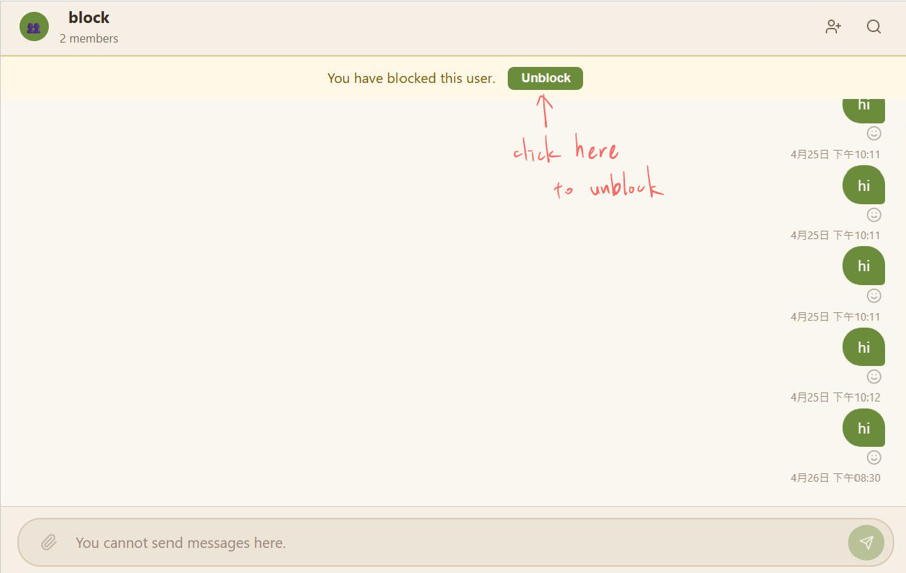
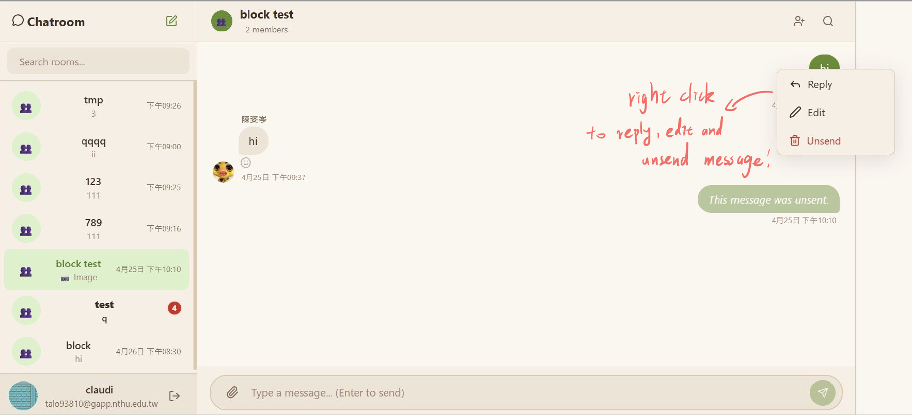

# React + Vite

This template provides a minimal setup to get React working in Vite with HMR and some ESLint rules.

Currently, two official plugins are available:

- [@vitejs/plugin-react](https://github.com/vitejs/vite-plugin-react/blob/main/packages/plugin-react) uses [Oxc](https://oxc.rs)
- [@vitejs/plugin-react-swc](https://github.com/vitejs/vite-plugin-react/blob/main/packages/plugin-react-swc) uses [SWC](https://swc.rs/)

##the functions of this website
1.you can create an a acount and sign in using your email address or simpy use your google account 
2.you can create a chatroom and invite multiple friends in there
3.you cann send message (text, image) and you can also unsend and edit it (but image can not be edited)
4.you can send emoji to a specific message, and you can also unsend it simply by clicking it
5.you can reply to a specific message, and by clicking a replied message you can easily find the original message
6.you can block user by right click their message and choose the block option
7.you will not be able to send messages to blocked user or the user who blocks you, also there will be a warning in your chat room (with only both of you)  
8.you can unblock the user by clicking the unblock button on the warning in the chatroom

##how to use this chatroom

##how to set up this project locally

1.Clone or download this repository to your local machine.

2.unzip it

3.open the folder in vscode or any editor

4.Install dependencies (if applicable):(in console)

npm install

5.Start the development server:(in console)

npm run dev(h+enter and then o+enter)

6.Open your browser and ensure the application runs correctly.

## React Compiler

The React Compiler is not enabled on this template because of its impact on dev & build performances. To add it, see [this documentation](https://react.dev/learn/react-compiler/installation).

## Expanding the ESLint configuration

If you are developing a production application, we recommend using TypeScript with type-aware lint rules enabled. Check out the [TS template](https://github.com/vitejs/vite/tree/main/packages/create-vite/template-react-ts) for information on how to integrate TypeScript and [`typescript-eslint`](https://typescript-eslint.io) in your project.
